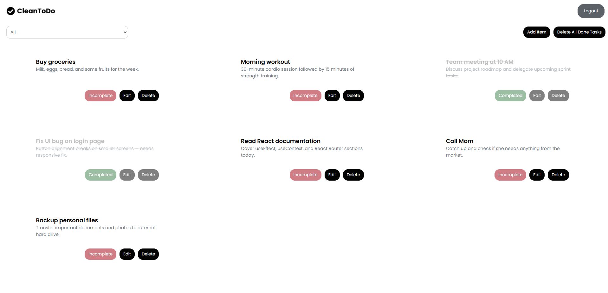

# 📝 React Todo List

A simple and clean Todo List web application built using React. This app lets users add, delete, and mark tasks as done. It also provides the functionality to delete all completed tasks with a single click.

## ✨ Features

- ✅ Add new tasks
- 🗑️ Delete individual tasks
- ☑️ Mark tasks as completed
- 🧹 Delete all completed tasks at once
- 💅 Simple, minimal UI

## 📸 Preview



## 🛠️ Built With

- React (with Hooks)
- HTML & CSS

## 📂 Folder Structure

TASK-TRACKER-APP/
├── node_modules/
├── screenshots/
│ └── image.png
├── src/
│ ├── assets/
│ ├── Components/
│ │ ├── Navbar.jsx
│ │ └── TodoList.jsx
│ ├── Controller/
│ │ └── useTodoList.js
│ ├── Models/
│ │ └── taskModel.js
│ ├── App.jsx
│ ├── index.css
│ ├── main.jsx
├── .gitignore
├── index.html
├── package.json
├── package-lock.json
├── vite.config.js
└── README.md

## 🚀 Getting Started

1. **Clone the repository**

```bash
git clone https://github.com/your-username/react-todo-list.git
cd react-todo-list

2. Install dependencies and run

npm install
npm start

