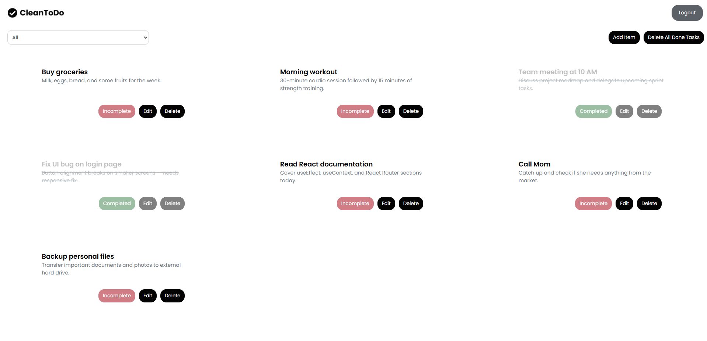
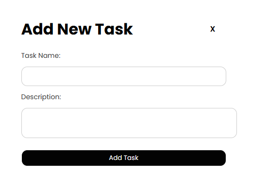
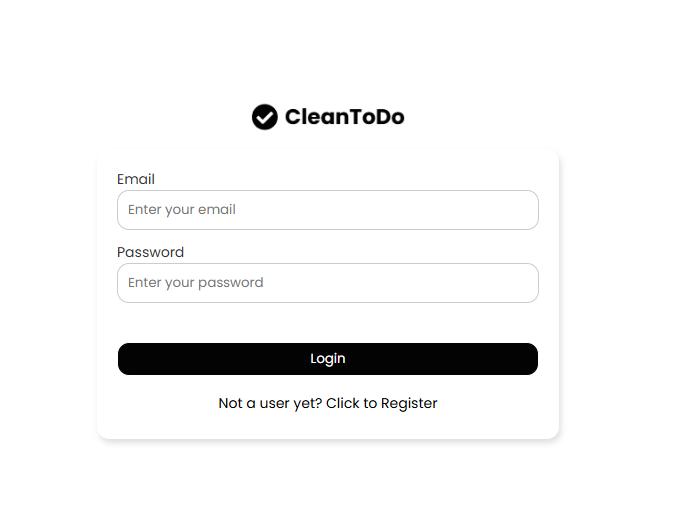
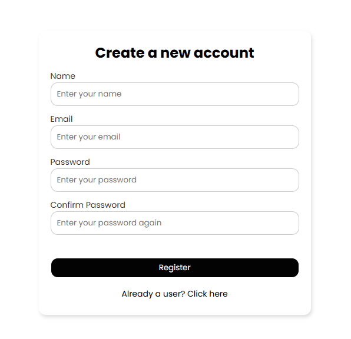

# ✅ CleanToDo — Complete Task Management App

A modern, clean, and feature-rich Todo List application built with the MERN stack. CleanToDo provides a seamless task management experience with user authentication, intuitive task operations, and a beautiful responsive interface.

---

## ✨ Key Features

### 🔐 **User Authentication**
- User registration with name, email, and password
- Secure login system
- Protected routes and user sessions
- "Not a user yet?" registration flow

### 📝 **Task Management**
- ➕ **Add New Tasks** - Create tasks with name and description
- ✏️ **Edit Tasks** - Modify existing task details
- ✅ **Mark as Completed** - Track task completion status
- 🗑️ **Delete Tasks** - Remove individual tasks
- 🧹 **Bulk Actions** - Delete all completed tasks at once

### 🎯 **Smart Organization**
- 📊 **Filter by Status** - View All, Incomplete, or Completed tasks
- 📋 **Task Categories** - Organize different types of tasks
- 💡 **Task Descriptions** - Add detailed descriptions to tasks
- 🏷️ **Status Indicators** - Clear visual status badges

### 💅 **Modern UI/UX**
- 🎨 Clean, minimal design with intuitive navigation
- 📱 Fully responsive across all devices
- 🖱️ Smooth hover effects and animations
- 🎯 Status-based color coding (Incomplete/Completed)
- ⚡ Fast and smooth interactions

---

## 🖼️ Application Screenshots

### Main Dashboard

*Main task management interface with filtering and bulk actions*

### Add New Task

*Clean form for adding new tasks with name and description*

### User Authentication
 
*Secure authentication system with login and registration*

---

## ⚙️ Tech Stack

### **Frontend**
- ⚛️ **React 19** - Latest component-based UI library
- 🎣 **React Hooks** - Modern state management
- 🔄 **Redux Toolkit** - Predictable state container
- 🛣️ **React Router DOM** - Client-side routing
- ⚡ **Vite** - Fast build tool and dev server
- 🎨 **CSS3** - Custom styling and animations
- 📱 **Responsive Design** - Mobile-first approach

### **Backend**
- 🌐 **Express.js 5** - Fast web framework for Node.js
- 🍃 **MongoDB & Mongoose** - NoSQL database with ODM
- 🔒 **JWT Authentication** - Secure token-based auth
- 🛡️ **bcryptjs** - Password hashing
- ✅ **Express Validator** - Input validation middleware
- 🌐 **CORS** - Cross-origin resource sharing
- 📡 **Axios** - HTTP client for API calls

### **Development Tools**
- 🔄 **Concurrently** - Run multiple npm scripts
- 👀 **Nodemon** - Auto-restart server on changes
- 🔍 **ESLint** - Code linting and formatting
- ⚙️ **dotenv** - Environment variable management

---

## 🚀 Quick Start

### Prerequisites
- Node.js (v14 or higher)
- MongoDB (local or cloud)
- npm or yarn

### Installation

1. **Clone the repository**
   ```bash
   git clone https://github.com/yourusername/cleantodo.git
   cd cleantodo
   ```

2. **Install dependencies**
   ```bash
   npm install
   ```

3. **Environment Setup**
   ```bash
   # Create .env file in root directory
   MONGODB_URI=your_mongodb_connection_string
   JWT_SECRET=your_jwt_secret
   PORT=5000
   ```

4. **Run the application**
   ```bash
   # Run both client and server concurrently
   npm run dev
   
   # Or run separately
   npm run dev:server  # Backend only
   npm run dev:client  # Frontend only (Vite)
   ```

5. **Access the app**
   - Frontend: `http://localhost:5173` (Vite default)
   - Backend API: `http://localhost:5000`

---

## 💡 Future Enhancements

- 🌙 **Dark Mode** - Theme switching capability
- 📅 **Due Dates** - Add deadline tracking
- 🏷️ **Task Categories** - Custom task categorization
- 📊 **Analytics** - Task completion insights
- 🔔 **Notifications** - Task reminders
- ✨ **Drag & Drop** - Reorder tasks
- 📱 **Mobile App** - React Native version
- 🌐 **Real-time Sync** - WebSocket integration

---

**Made with ❤️ and the MERN stack**
